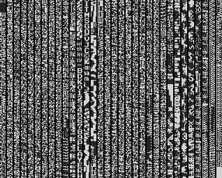
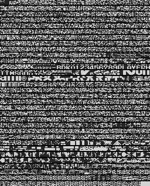
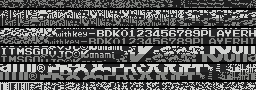
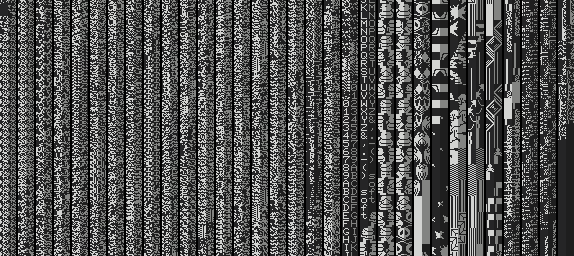
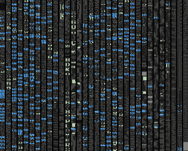
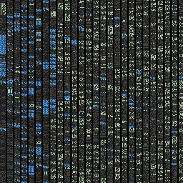

# Binary files-2-PNG

Quick'n'dirty tool to visually inspect binary files as PNG image files.


## Usage

```
usage: java -jar bin2png.jar
  -help           Shows usage
  -size <arg>     Size, in pixels (default: 256)
  -spacing <arg>  Spacing, in pixels (default: 2)
  -h,--horizontal Uses the horizontal visualizer
  -l,--highlight  Uses the padding/ASCII/CALLs/JPs highlight visualizer
  -s,--sprites    Uses the 16x16 sprites visualizer
  -c,--charset    Uses the charset graphics visualizer
  <input>         Binary input file
  <output>        PNG output file (optional, defaults to <input>.png)
```


## Vertical visualizer (default)

Shows the binary file as vertical stripes of 1-bit data. _8x8_ graphic data can be found with this visualizer.




## Horizontal visualizer (`-horizontal`)

Shows the binary file as horizontal stripes of 1-bit data. Can be more practical to visualize larger files.




## Charset graphics visualizer (`-charset`)

Shows the binary file as horizontal stripes of 1-bit data using double height with offset +8. There will be some redundancy, but _&lt;n&gt;x8_ graphic data will be easier to spot, even if the data is not aligned.




## 16x16 sprites visualizer (`-sprites`)

Shows the binary file as vertical stripes of 1-bit data using double width with offset +16. There will be some redundancy, but _16x16_ sprites can be found with this visualizer.




## Padding/ASCII/CALLs/JPs highlight visualizer (`-highlight`)

Shows the binary file as vertical stripes of 1-bit data, but highlighting:
- Padding values (`$00` and `$ff`),
- ASCII printable values (between `$20` and `$7f`),
- Z80 calls (any _CALL_ opcode followed by a 16-bit value between `$4000` and `$bfff`), and
- Z80 jumps (any _JP_ opcode followed by a 16-bit value between `$4000` and `$bfff`).



Binary structure can be found with this visualizer, as code and text sections are easily spotted.

For example, a text-based adventure game:


